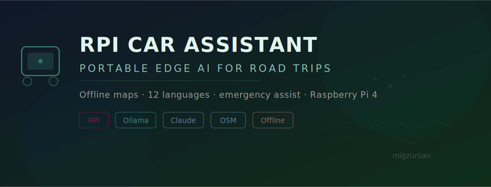

<p align="center">
  
</p>

<p align="center">
  <strong>A Raspberry Pi-powered emergency assistant for the car: offline maps, multilingual support, and AI-powered help when you need it most — even without signal.</strong>
</p>

<p align="center">
  
  
  
  
  
  
</p>

<p align="center">
  <a href="#why-this-exists">Why</a> •
  <a href="#architecture">Architecture</a> •
  <a href="#features">Features</a> •
  <a href="#hardware">Hardware</a> •
  <a href="#setup">Setup</a> •
  <a href="#lessons-learned">Lessons</a>
</p>

---

## Why This Exists

Driving across Europe means crossing language barriers, dealing with unfamiliar road regulations, and occasionally breaking down in places with zero cell signal. Commercial GPS and phone apps assume you're always online. This assistant doesn't.

Built for multi-country European road trips, the RPi Car Assistant provides:

- **Emergency help in any language** — translate breakdown symptoms, find the nearest hospital, call for roadside assistance in the local language
- **Offline maps and navigation** — pre-downloaded OpenStreetMap tiles for the entire route
- **AI-powered diagnostics** — describe a warning light or weird noise, get plain-language guidance
- **Dual-mode intelligence** — local LLM (Ollama) when offline, Claude API when connected for complex queries

---

## Architecture

```mermaid
flowchart TB
    subgraph HARDWARE ["🔧 Hardware Layer"]
        RPI[Raspberry Pi 4B<br/>4GB RAM] --> SCREEN[7" Touchscreen<br/>Official RPi Display]
        RPI --> GPS[USB GPS Module]
        RPI --> MIC[USB Microphone]
        RPI --> SPK[3.5mm Speaker]
        PWR[USB-C Power<br/>Car 12V Adapter] --> RPI
    end

    subgraph OFFLINE ["✈️ Offline Mode (No Signal)"]
        INPUT[Voice / Touch Input] --> LOCAL_STT[Local STT<br/>Whisper.cpp]
        LOCAL_STT --> LOCAL_LLM[Ollama<br/>Mistral 7B Q4]
        LOCAL_LLM --> RESPONSE[Response]
        MAPS_DB[(OSM Tiles<br/>Pre-downloaded)] --> NAV[Offline Navigation]
        PHRASE_DB[(Phrasebook DB<br/>Emergency phrases<br/>in 12 languages)] --> TRANSLATE[Quick Translate]
    end

    subgraph ONLINE ["🌐 Online Mode (Signal Available)"]
        INPUT2[Voice / Touch Input] --> CLOUD_STT[Whisper API<br/>or Gemini STT]
        CLOUD_STT --> CLAUDE[Claude API<br/>Complex reasoning]
        CLAUDE --> RESPONSE2[Response]
        LIVE_MAPS[Live Map Tiles] --> LIVE_NAV[Turn-by-turn Nav]
    end

    subgraph CORE ["🧠 Mode Manager"]
        CONNECTIVITY{Internet<br/>Available?}
        CONNECTIVITY --> |Yes| ONLINE
        CONNECTIVITY --> |No| OFFLINE
    end

    RPI --> CORE

    style HARDWARE fill:#1a1a2e,stroke:#16213e,color:#e0e0e0
    style OFFLINE fill:#16213e,stroke:#0f3460,color:#e0e0e0
    style ONLINE fill:#0f3460,stroke:#533483,color:#e0e0e0
    style CORE fill:#533483,stroke:#e94560,color:#e0e0e0
```

### Design Decisions

| Decision | Choice | Why |
|---|---|---|
| **Board** | Raspberry Pi 4B (4GB) | Best balance of power, availability, and community support. 8GB unnecessary for quantized models. |
| **Local LLM** | Mistral 7B (Q4 quantized via Ollama) | Fits in 4GB RAM with room for OS. Reasonable response quality for emergency guidance. Larger models too slow on Pi. |
| **Maps** | Pre-downloaded OSM tiles | Google Maps requires internet. OSM tiles can cover an entire country in ~2-4GB. |
| **Phrasebook** | SQLite DB with pre-translated phrases | LLM translation is slow offline. Pre-cached emergency phrases in 12 languages give instant results. |
| **Connectivity detection** | Periodic ping + GPS-based cell coverage map | Simple ping catches most cases. Cell coverage overlay catches the edge case of "connected but unusable" signal. |
| **Power** | USB-C from 12V car adapter | Always-on while driving. Auto-shutdown on power loss (car off) to prevent SD card corruption. |

---

## Features

### Emergency Assistance

```
You:     "The engine temperature warning light is on"
Assistant: "Pull over safely and turn off the engine immediately.
           This likely indicates overheating. Do NOT open the
           hood until the engine cools (15-20 minutes).
           
           Nearest service station: 4.2km ahead on E45
           Emergency number for this country: 112
           
           In German: 'Mein Auto ist überhitzt. Ich brauche
           einen Abschleppdienst.'"
```

### Offline Phrasebook

Pre-loaded emergency phrases covering:

| Category | Examples |
|---|---|
| **Breakdown** | "My car won't start" / "I have a flat tire" / "The engine is overheating" |
| **Medical** | "I need a hospital" / "Someone is injured" / "I'm having an allergic reaction" |
| **Navigation** | "Where is the nearest gas station?" / "How do I get to the highway?" |
| **Police/Legal** | "I've been in an accident" / "I need to file a report" |
| **General** | "Do you speak English?" / "Please call for help" / "Thank you" |

Available in: English, Spanish, French, German, Italian, Portuguese, Dutch, Danish, Polish, Czech, Croatian, Greek.

### Offline Navigation

- Pre-downloaded OpenStreetMap tiles for planned route + 100km buffer
- GPS positioning via USB module (no internet needed)
- Points of interest: hospitals, gas stations, police stations, rest areas
- Route calculation using OSRM (Open Source Routing Machine) running locally

---

## Hardware

### Bill of Materials

| Component | Model | Purpose | Approx. Cost |
|---|---|---|---|
| Single-board computer | Raspberry Pi 4B (4GB) | Core compute | ~€60 |
| Display | Official RPi 7" Touchscreen | UI | ~€70 |
| GPS | VK-162 USB GPS (u-blox 7) | Positioning | ~€15 |
| Microphone | USB conference mic | Voice input | ~€20 |
| Speaker | 3.5mm portable speaker | Audio output | ~€15 |
| Storage | 128GB microSD (A2 rated) | OS + maps + models | ~€20 |
| Power | Anker USB-C car charger (30W) | 12V → USB-C | ~€15 |
| Case | 3D printed mount (STL included) | Dashboard mount | ~€5 |
| **Total** | | | **~€220** |

### Assembly

```
┌──────────────────────────────────────────────┐
│  Dashboard Mount (3D Printed)                │
│  ┌────────────────────────────────┐          │
│  │     7" Touchscreen Display     │          │
│  │  ┌──────────────────────────┐  │          │
│  │  │                          │  │  USB ──▶ GPS
│  │  │    Raspberry Pi 4B       │  │  USB ──▶ Mic
│  │  │    (mounted behind       │  │  3.5mm ▶ Speaker
│  │  │     display)             │  │  USB-C ◀ Car Power
│  │  │                          │  │          │
│  │  └──────────────────────────┘  │          │
│  └────────────────────────────────┘          │
└──────────────────────────────────────────────┘
```

---

## Project Structure

```
rpi-car-assistant/
├── main.py                          # Entry point + mode manager
├── config/
│   ├── assistant.yaml               # Main configuration
│   └── countries.yaml               # Country-specific data (emergency numbers, languages)
├── core/
│   ├── mode_manager.py              # Online/offline detection + switching
│   ├── voice_input.py               # Microphone capture + STT routing
│   └── llm_router.py                # Ollama (offline) vs Claude (online)
├── features/
│   ├── emergency.py                 # Emergency assistance logic
│   ├── phrasebook.py                # Offline phrase lookup
│   ├── navigation.py                # Map display + routing
│   └── diagnostics.py               # Vehicle warning light interpreter
├── data/
│   ├── phrasebook.db                # SQLite: emergency phrases × 12 languages
│   ├── osm_tiles/                   # Pre-downloaded map tiles (not in repo)
│   └── models/                      # Ollama model files (not in repo)
├── ui/
│   ├── touchscreen.py               # PyQt6 touch-optimized interface
│   └── assets/
│       └── icons/                   # UI icons for categories
├── hardware/
│   ├── gps.py                       # USB GPS reader
│   └── power_monitor.py             # Graceful shutdown on power loss
├── scripts/
│   ├── download_tiles.py            # Pre-download OSM tiles for a route
│   ├── download_model.py            # Pull Ollama model
│   └── build_phrasebook.py          # Generate phrasebook DB from translations
├── stl/
│   └── dashboard_mount.stl          # 3D printable mount
├── tests/
├── .env.example
├── requirements.txt
└── README.md
```

---

## Setup

### Prerequisites

- Raspberry Pi 4B (4GB+ RAM) with Raspberry Pi OS (64-bit)
- Hardware listed in BOM above
- WiFi connection for initial setup

### Installation

```bash
# Clone the repo
git clone https://github.com/migzursan/rpi-car-assistant.git
cd rpi-car-assistant

# Install system dependencies
sudo apt-get update && sudo apt-get install -y \
    python3-pyqt6 gpsd gpsd-clients libatlas-base-dev

# Install Python dependencies
pip install -r requirements.txt

# Install Ollama + download model
curl -fsSL https://ollama.com/install.sh | sh
ollama pull mistral:7b-instruct-v0.2-q4_K_M

# Download map tiles for your route
python scripts/download_tiles.py --route "Copenhagen,Denmark" "Málaga,Spain" --buffer 100km

# Build phrasebook database
python scripts/build_phrasebook.py

# Configure
cp .env.example .env
# Edit .env with your Claude API key (for online mode)

# Run
python main.py
```

### Pre-Trip Checklist

```
□ Map tiles downloaded for full route + buffer
□ Ollama model pulled and tested
□ GPS module getting fix (test outdoors)
□ Power supply stable from car adapter
□ All 12 language phrasebooks loaded
□ Emergency numbers verified for each country on route
□ Claude API key set (for online features)
□ SD card backed up
```

---

## Lessons Learned

### 1. Quantization is the entire game on edge hardware
Mistral 7B runs fine on a Pi 4 — but only at Q4 quantization. Q8 is too slow. Q2 is too dumb. The sweet spot is narrow, and you only find it by testing on the actual hardware, not a desktop simulator.

### 2. Offline-first is a design philosophy, not a fallback
I initially built online mode first and added offline as a fallback. Wrong approach. Building offline-first means every feature works without internet by default, and online mode just makes it better. This fundamentally changes how you architect data access, caching, and UX.

### 3. Pre-computed beats real-time for emergencies
When someone is stressed and broken down on a highway, they don't want to wait 8 seconds for an LLM to generate a translation. The phrasebook (instant SQLite lookup) handles 90% of emergency communication. The LLM handles the long-tail creative queries.

### 4. Power management is not optional on Pi
The first prototype corrupted its SD card three times because I didn't handle sudden power loss (ignition off). A proper shutdown script monitoring the power GPIO pin fixed this permanently. Lesson: on embedded systems, ungraceful shutdown is the default, not the exception.

### What I'd Do Differently
- **Use an SSD instead of microSD.** SD cards are the #1 reliability risk. A USB SSD is faster, more durable, and worth the extra €20.
- **Add a cellular fallback modem.** A cheap 4G USB dongle with a local data SIM would close the gap between "no signal" and "connected." Currently the transition is binary.
- **Build a companion phone app.** Sometimes you want to query the assistant without being in the car. A simple app that connects over local WiFi when nearby would extend the utility.

---

## Acknowledgments

- [OpenStreetMap](https://www.openstreetmap.org/) contributors for map data
- [Ollama](https://ollama.com/) for making local LLM inference accessible
- [OSRM](http://project-osrm.org/) for offline routing

---

<p align="center">
  Built by <a href="https://migzursan.github.io">Miguel Zurbano</a> · Because GPS doesn't work in tunnels and Google Translate doesn't work without signal.
</p>
